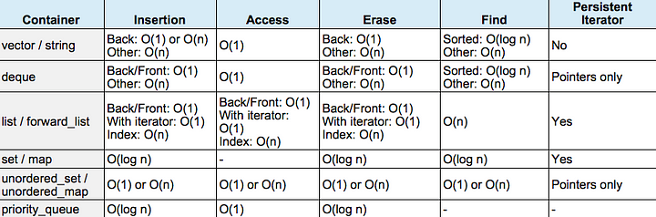

<!-- _class: first-slide -->
---
# C++ Training
## Algorithms and containers
<!-- _class: second-slide -->
---
# Complexity


---
# Time complexity
- O(1). Regardless of #elements, operation takes constant time. e.g. size of vector
- O(n). Loop over each element and do an operation. e.g. print all items
- O(log(n)+c). Base 2. e.g. Binary search 
-- Size 7. Worst case search complexity log(7) -> 3

---
## log(n)


---
## Complexity of C++ containers


when sorted assumes binary search is used. which is log(n)

---
## std::vector
- std::array. Fixed size memory. could be stack. could be heap.
- std::vector. heap allocates. Dynamic Size
- Insertion -> N operations may be needed if needs to reallocate
- Access -> random access due to memory layout
- Erase -> N operations may be needed to due copying to fill gap
- Find -> log(N) if sorted
- No persistent iterators due to reallocation;
---
## resizing an std::vector
```cpp
void print(auto const& x)
{
    std::cout << "capacity: "<< x.capacity() << " "<< &x[0]<<std::endl;
}
int main()
{
    std::vector<int> v;

    for(int i = 0; i< 10; i++)
    {
        v.push_back(i);
        print(v);
    }
}
```
---
- If capacity grows the heap address changes, hinting at realloction
- Expensive operation
```cpp
Program stdout
capacity: 1 0xa53eb0
capacity: 2 0xa54ee0
capacity: 4 0xa53eb0
capacity: 4 0xa53eb0
capacity: 8 0xa54f00
capacity: 8 0xa54f00
capacity: 8 0xa54f00
capacity: 8 0xa54f00
capacity: 16 0xa54f30
capacity: 16 0xa54f30
```
---

## std::list / std::forward_list
- std::list = double linked list (forward and backwards traversable)
- Insertion -> 1, updating of node pointers
- Access -> N, no random access
- Erase -> 1, updating node pointers
- Find -> N even if sorted, no random access
- Iterators are persistent due to pointer updates.
---
## std::deque
- Hybrid between std::vector and std::list
- Linked list like structure, each node(bucket) of the list has the capacity to store more than 1 element.
- The O(1) access complexity of std::deque is paid for by increasing space complexity, hashmap
---
## std::deque
- Insertion -> 1, insert new node at front or back. else vector behaviour
- Access -> 1, hashmap. mandated by standard
- Erase -> 1, remove front or back else vector behaviour
- Find -> 1, hashmap
---
## std::deque
```cpp
template<
    class T,
    class Allocator = std::allocator<T>
> class deque;
```
- Bucket size ?
- Larger objects (e.g. sizeof(T) == sizeof(Bucket)), std::deque turns into a convoluted std::list, which may perform worse if random access is not a requested feature
```cpp
#ifndef _GLIBCXX_DEQUE_BUF_SIZE
#define _GLIBCXX_DEQUE_BUF_SIZE 512
#endif

_GLIBCXX_CONSTEXPR inline size_t
__deque_buf_size(size_t __size)
{ 
    return (__size < _GLIBCXX_DEQUE_BUF_SIZE ? size_t(_GLIBCXX_DEQUE_BUF_SIZE / __size) : size_t(1)); 
}
```
---
## std::map
- std::set is an std::map where the value is also used as key/comparator implementation
- log(n) across the board. mandated by the standard. Typically rb-tree.
- Not contiguous in memory
---
## rb-trees
- Left child node is smaller than parent node
- Right child node is larger than parent node
- Self-balancing on insert/erase
- Finding an element -> half of the tree can be ignored
- log(n) search property. 
- Rebalancing the tree is log(n)
---
## std::unordered_map/std::unordered_set
- O(1) achieved by hashing. Hashing can be expensive. O(1) can be bad.
- If you need to store unique elements and care about order, use std::set.
- Store unique elements and do not care about order use set::unordered_set.
---

## std::unordered_map/std::unordered_set
```cpp
template<
    class Key,
    class Hash = std::hash<Key>, // find bucket
    class KeyEqual = std::equal_to<Key>, //find element in bucket
    class Allocator = std::allocator<Key>
> class unordered_set;

template<
    class Key,
    class Compare = std::less<Key>,
    class Allocator = std::allocator<Key>
> class set;
```
---
# Space complexity
- Implementation defined
1. std::vector: 8 bytes - contigious
2. std::deque: size of block - not contigious
3. std::list: 24 bytes - not contigious
4. std::set: 8 + 3 * 8 + 8 - not contigious

---
```cpp
template <typename T>
struct MyAllocator {
    using value_type = T; //needed by std::set
    T* allocate(std::size_t n) {
        std::cout << "Allocating: " << n * sizeof(T) << " bytes"<<std::endl;
        return static_cast<T*>(::operator new(n * sizeof(T)));
    }
    void deallocate(T* p, std::size_t /*n*/) { // n is not needed
        ::operator delete(p);
    }
};
int main() {
    using MySet = std::set<uint64_t, std::less<uint64_t>, MyAllocator<uint64_t>>;
    MySet mySet;
    mySet.insert(20);
}
---
Allocating: 40 bytes
```
https://gcc.gnu.org/onlinedocs/libstdc++/libstdc++-html-USERS-4.1/structstd_1_1___rb__tree__node.html

---

```cpp
template <typename T>
struct CustomAllocator {
    using value_type = T;
    CustomAllocator() noexcept = default;
    template <typename U>
    CustomAllocator(const CustomAllocator<U>&) noexcept {}
    T* allocate(std::size_t n) {
        std::cout << "Allocating " << this << " name="<< typeid(T).name() 
		   <<" n="<< n << " T="<< sizeof(T) << std::endl;
        if (auto p = static_cast<T*>(std::malloc(n * sizeof(T)))) {
            return p;
        }
        throw std::bad_alloc();
    }
    void deallocate(T* p, std::size_t) noexcept {
        std::cout << "Deallocating" <<std::endl;
        std::free(p);
    }
};
```
---
```cpp
int main() 
{
    using T = std::string;
    using MySet = std::unordered_set<T, std::hash<T>, std::equal_to<T>, CustomAllocator<T>>;
    CustomAllocator<T> myAllocator;
    MySet mySet({}, 1, std::hash<T>(), std::equal_to<T>(), myAllocator);
    std::cout << "created bucket"<<std::endl;
    mySet.insert("a");
    std::cout << "inserted element"<<std::endl;
    for (auto const& element : mySet) {
        std::cout << "value="<<element << " hash=" << std::hash<T>()(element)<< std::endl;
    }
    return 0;
}
---
Allocating 0x7ffc3ef5dc8f name=PNSt8__detail15_Hash_node_baseE n=2 T=8
created bucket
Allocating 0x7ffc3ef5de50 name=NSt8__detail10_Hash_nodeINSt7__cxx1112basic_stringIcSt11char_traitsIcESaIcEEELb1EEE n=1 T=48
inserted element
value=a hash=4993892634952068459
Deallocating
Deallocating
```
---
# exercises
exercises/containers/ex1.cpp

Set-up an alloctor to avoid allocating in the hot path.

---
## Data locality
- Decrease time complexity, increase space complexity
- Increased space complexity could reduce performance due to decreased data locality.
- Locality std::vector > locality std::set
- Pointer chasing is really bad for performance

---
## Hardware and speed
- Register
- Cache (L1>L3)
- Ram
- Flash

Typically want data that is used together to be in cache.

---
## False sharing
- Data is transferred from memory to cache in blocksize = cache line
- Cache lines are invalidated on data write
- L1 cache lines are typically not shared between cores
- False sharing
```bash
william@vbox:~$ getconf LEVEL1_DCACHE_LINESIZE
64
```
---
## False sharing
```cpp
uint8_t[64] _cacheLine;
```
- CORE-0 writes to _cacheLine[0];
- CORE-1 writes to _cacheLine[7];
- Cache line constantly invalidated, constantly reshared between cores,
CPU does not know which byte in cache line is invalidated, it only knows that block of bytes needs to be synced
----
## False sharing
- Avoid false sharing by allocating on cache line boundary
- Aligning memory can be done by using alignas (C++11)
```cpp
int main()
{
    alignas(sizeof(decltype(_cacheLine)) uint64_t a;
    alignas(sizeof(decltype(_cacheLine)) uint64_t c;
    std::cout << &a << std::endl;
    std::cout << &c << std::endl;
    std::cout << (&a - &c) << std::endl;
}
---
0x7ffc876e9c40
0x7ffc876e9c00
8
```
---
## Array of structures vs structure of arrays
- False sharing is an issue
- Data locality is an issue
- Consider a set of Layer 2 network packets
```cpp
struct L2 {
    uint16_t sourcePort;
    uint16_t destinationPort;
    uint64_t sourceMacAddress;
    uint64_t destinationMacAddress;
};
```
Rewrite source port to some other value eg NAT

---
## Array of structures
```cpp
struct L2 
{
    uint16_t sourcePort;
    uint16_t destinationPort;
    uint64_t sourceMacAddress;
    uint64_t destinationMacAddress;
};
int main() 
{
    const size_t packetCount = 100;
    std::array<L2, packetCount> stream;
    for (int i = 0; i < packetCount; ++i) {
        if (stream[i].sourcePort == 123) {
            stream[i].sourcePort = 0;
        }
    }
    return 0;
}
```
---
## Structure of arrays
```cpp

struct Stream {
    std::vector<uint16_t> sourcePort;
    std::vector<uint16_t> destinationPort;
    std::vector<uint64_t> sourceMacAddress;
    std::vector<uint64_t> destinationMacAddress;
};

int main() {
    const size_t packetCount = 100;
    Stream stream;
    for (int i = 0; i < packetCount; ++i) {
        if (stream.sourcePort[i] == 123) {
            stream.sourcePort[i] = 0;
        }
    }
    return 0;
}
```
---
## Optimizations
- Profile your code
- Measure cache misses in hot path: cachegrind
	1. Change layout of data members
	2. Avoid allocating in hot path
	3. Manage algorithmic complexity
---
# exercises
exercises/containers/ex2.cpp

Try-out and fix false sharing on your setup

---
## Algorithms of the core library
- Make code more expressive: raises the level of abstraction
- Avoid common mistakes; empty containers, too complex
- Rely on tested algorithms used by many developers
---
## Heaps
- Binary tree variant called a heap
- No memory overhead, retrieval of the maximum or minimum(depending on heap configuration) element with O(1) complexity
- Unlike RB-trees, not possible to find random elements using O(log n) complexity. Inserting an element is O(log n) complex.
---

```cpp
void print(auto container)
{
    for(auto const& e:container) {
        std::cout << e<< ' ';
    }
    std::cout <<std::boolalpha<< 
		std::is_heap(std::begin(container), std::end(container)) <<std::endl;
}
int main()
{
    std::vector<int> x = {4,7,-1, 5, 4, 3};
    print(x);
    std::make_heap(std::begin(x), std::end(x));
    print(x);
    x.push_back(100);
    print(x);
    std::push_heap(std::begin(x), std::end(x));
    print(x);
}
---
Program stdout
4 7 -1 5 4 3 false
7 5 3 4 4 -1 true
7 5 3 4 4 -1 100 false
100 5 7 4 4 -1 3 true
```
---
Most common use-case for me is to get some kind of min/max measurement, store the measurements and get O(1) access to largest/smallest measurement

---
## Sorting
- The standard requires std::sort to do max O(n log(n)) comparisons at most.
- Introsort provides this worst-case performance complexity and is used by for example gcc.

---
## Sorting example
```cpp
void print(auto container)
{
    for(auto e:container)
    {
        std::cout << e<< ' ';
    }
    std::cout << std::boolalpha<<std::is_sorted(std::begin(container), std::end(container)) <<std::endl;
}
int main()
{
    std::vector<int> x = {4,7,-1, 5, 4, 3};
    print(x);
    std::sort(std::begin(x), std::end(x));
    print(x);
    std::cout << "Has element: "<< (std::find(std::begin(x), std::end(x), 4) != std::end(x)) << std::endl;
    std::cout << "Has element: "<< std::binary_search(std::begin(x), std::end(x), 4) << std::endl;
}
---
4 7 -1 5 4 3 false
-1 3 4 4 5 7 true
Has element: true
Has element: true
```

---
## Linear vs binary search
- It is possible to find an element using std::find: O(n)
- std::binary_search and std::lower_bound O(log(n)) -> requires sorted range. Undefined behaviour if range is unsorted
---
## Partitioning a container
- std::partition partitions a range in 2 parts based on some predicate.
- std::stable_partition makes sure that internal position of elements in both parts is maintained.

---
## Partitioning example
```cpp
void print(auto const& container)
{
    for(auto const& e:container)
    {
        std::cout << e<< ' ';
    }
    std::cout << std::boolalpha<<std::is_sorted(std::begin(container), std::end(container)) <<std::endl;
}
int main()
{
    std::vector<int> x = {4,7,-1, 5, 4, 3};
    print(x);
    auto backup_x = x;
    std::partition(std::begin(x), std::end(x), [](auto e){ return e > 4;});
    print(x);
    std::stable_partition(std::begin(backup_x), std::end(backup_x), [](auto e){ return e > 4;});
    print(backup_x); 
}
---
4 7 -1 5 4 3 false
5 7 -1 4 4 3 false
7 5 4 -1 4 3 false
```

---
## Transform/reduce
- std::transform is used to type convert while looping over a collection. 
- std::reduce/std::accumulate collapses a range into 1 element by applying a functor to each element.

---
### Transform/reduce example
```cpp
struct Equity
{
    std::string name;
    int value;
};
int main()
{
    std::vector<Equity> equities = {{"goog",100}, {"aapl", 200}};

    std::vector<int> values(std::size(equities));
    std::transform(std::begin(equities), std::end(equities), std::back_inserter(values), [](auto e){return e.value;});
    int total_value = std::reduce(std::begin(values), std::end(values));
    std::cout << "Total equity value: "<< total_value << std::endl;

    int total_value_2 = std::transform_reduce(std::begin(equities), std::end(equities), 0, 
        std::plus<>(), [](auto e){return e.value;});

    std::cout << "Total equity value: "<< total_value_2 << std::endl;
}
```
---
### std::generate, std::fill and std::copy
- std::generate, executes a functor for each element in the container and assigned its return value to that value.
- std::fill assigns an identical value to each element
- std::copy, copies element from one container to another.

---
### std::generate, std::file and std::copy example
```cpp
void print(auto container)
{
    for(auto e:container)
    {
        std::cout << e<< ' ';
    }
    std::cout << std::endl;
}
auto generator = [i = 0]() mutable {return i++;};
int main()
{
    std::vector<int> x(10);

    std::fill(std::begin(x), std::end(x), 1);
    print(x);
    std::generate(std::begin(x), std::end(x), generator);
    print(x);
    std::copy(std::begin(x), std::begin(x)+2, std::begin(x)+2);
    print(x);
}
---
1 1 1 1 1 1 1 1 1 1 
0 1 2 3 4 5 6 7 8 9 
0 1 0 1 4 5 6 7 8 9 
```
---
## Algorithms
- STL algorithms often require pipelining
- When transforming elements from one vector into another, you may not want to transform each element. e.g. some element is null. You can create a custom iterator
- Stl algorithms are not lazy.
- Ranges! C++20 feature.

---
## Custom iterator
```cpp
template<class C, class F>
class conditional_back_insert_iterator {
protected:
  C* container;
  F  f;
public:
  using container_type = C;
  using iterator_category =std::output_iterator_tag;
  using value_type=void;
  using difference_type=void;
  using pointer=void;
  using reference=void;
    
  explicit conditional_back_insert_iterator( C& __x, F __f ) :
		container( &__x ), f(std::move(__f)) { }
    
  conditional_back_insert_iterator& operator=(typename C::value_type const& v) 
  { 
    if (f(v)){
      container->push_back(v);
    }
    return *this;
  }
}   
```
---
## ranges vs iterators example.
```cpp
struct Element{
    int x;
};
int main(){
    auto filter = [](int i) { return i < 5; };
    auto transform = [](int i) -> Element { return Element{i}; };
    std::vector<Element> filtered_elements;
    std::vector<int> container = {1, 2, 3, 4, 5, 6, 7, 8};
    std::transform(
        std::begin(container),
        std::end(container), 
        conditional_back_insert_iterator(filtered_elements, 
	[](Element e){return e.x < 5;}), [](int x){return Element{x};});
    print(std::begin(filtered_elements), std::end(filtered_elements));
    std::cout << std::endl;
    auto lazy_evaluation = container | std::views::filter(filter) | std::views::transform(transform);
    print(std::begin(lazy_evaluation), std::end(lazy_evaluation));
}
```
---
```cpp
template <typename T>
void print(T begin, T end)
{
    for(auto it = begin; it !=end; it++)
    {
        Element const& e = *it;
        std::cout << e.x<< ' ';
    }
}
```
---
# exercises
exercises/containers/ex3.cpp
...
exercises/containers/ex9.cpp

---
<!-- _class: final-slide -->
